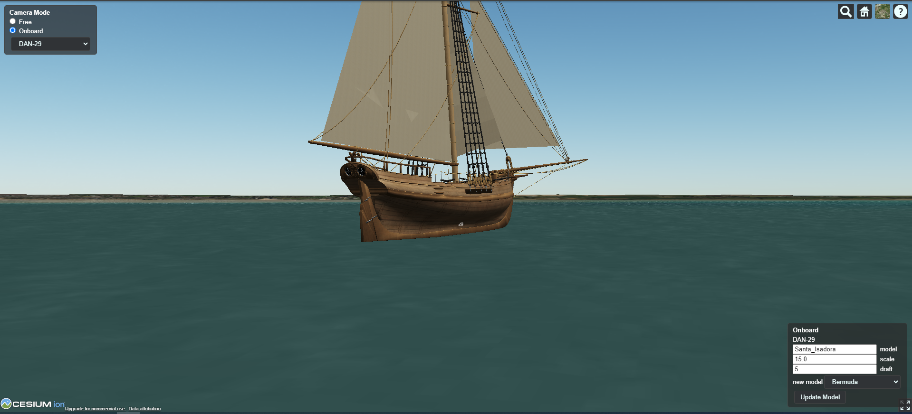

# VRShoreView

More realistic 3D look for the [Virtual Regatta](https://www.virtualregatta.com/en/offshore-game/).

This progect uses [A Tool for Building Expert Systems CLIPS](https://www.clipsrules.net/), 
[3D geospatial visualization for the web](https://cesium.com/platform/cesiumjs/) and
[VR Dashboard plugin](https://chrome.google.com/webstore/search/VR%20Dashboard)

[](https://youtu.be/SP4-xvm6yMo)
Click the screenshot to see a video!

## Prerequisites

You need to be installed on your machine:

1. [VR Dashboard](https://chromewebstore.google.com/detail/vr-dashboard/amknkhejaogpekncjekiaolgldbejjan)

2. Python3
    For Windows please check the Microsoft App store or download the installer [here](https://www.python.org/downloads/windows/)
        The location of python.exe will be determined using PATH variable.
    For others platforms please follow the instructions for your OS or download the tarball [here](https://www.python.org/downloads/)


## Installation and usage

Download VRShoreView project from the Github using a button "Code" on this page and unzip somewhere. Then:

1. Open "Virual Regatta" page in a browser.
2. Activate "VR Dashboard" plugin. 
3. Start VRShoreView program:

```shell
$ cd <..>/VRShoreView
$ ./VRShoreView.sh russor Bermuda		# Linux, MacOS
$ VRShoreView.bat russor Bermuda        # Windows
```
#### Notes: 

1. Replace "russor" with your boat name.
2. Replace "Bermuda" with your choice of boat's model type. Full list of model types
 is in a file "<..>/VRShoreView/clp/FactsModels.clp". You can add your models in this file approprietly.


Copyright © 2024 Ruslan Sorokin

